# Netflix Analytics — Snowflake & dbt Data Engineering Project

## **1. Project Overview**

This project implements an end-to-end **data engineering and analytics pipeline** using **Amazon S3, Snowflake, and dbt Cloud**.

Movie-related data is ingested from Amazon S3 into Snowflake using an external stage and `COPY INTO`. dbt is then used to build a structured transformation layer consisting of **staging models, core dimensions and facts, incremental models, snapshots, seeds, macros, data tests, and an analytics mart**.

The project demonstrates how raw data can be transformed into reliable, analytics-ready datasets using a modern cloud data stack.

---

## **2. Project Objectives**

The main objectives of this project are:

1. Ingest movie data from Amazon S3 into Snowflake.
2. Build a structured Snowflake data warehouse using multiple schemas.
3. Transform raw data using dbt staging and core models.
4. Build reusable analytical models and a reporting mart.
5. Implement multiple dbt incremental strategies.
6. Track historical changes using dbt snapshots.
7. Use dbt seeds for reference data.
8. Create reusable Jinja macros.
9. Implement built-in and custom data-quality tests.
10. Manage the project using GitHub and dbt Cloud.

---

## **3. Architecture**

```text
                         Amazon S3
                            │
                            ▼
                 Snowflake External Stage
                            │
                            ▼
                     RAW Data Layer
                            │
                            ▼
                    dbt Source Layer
                            │
                            ▼
                   dbt Staging Layer
                            │
                            ▼
                     dbt CORE Layer
                    ┌───────┴────────┐
                    │                │
                 Dimensions         Facts
                    │                │
                    └───────┬────────┘
                            ▼
                 Movie Rating Summary
                            │
                            ▼
                  Reporting / MART Layer
                            │
                            ▼
                    Analytics Output
```

---

## **4. Technology Stack**

| Technology    | Purpose                                                            |
| ------------- | ------------------------------------------------------------------ |
| **Amazon S3** | Source data storage                                                |
| **Snowflake** | Cloud data warehouse and data ingestion                            |
| **dbt Cloud** | Data transformation, testing, snapshots, macros, and documentation |
| **SQL**       | Data transformation and validation                                 |
| **Jinja**     | Reusable dbt macros and dynamic SQL                                |
| **GitHub**    | Version control and project management                             |

---

## **5. Source Data**

The project works with the following movie-related datasets:

1. **Movies** — movie identifiers, titles, and genres
2. **Ratings** — user ratings for movies
3. **Tags** — user-generated movie tags
4. **Genome Scores** — movie/tag relevance scores
5. **Genome Tags** — genome tag definitions
6. **Links** — movie identifiers mapped to external movie databases

The source CSV files are stored in Amazon S3 and loaded into Snowflake RAW tables using `COPY INTO`.

---

## **6. Snowflake Implementation**

### **6.1 Database**

```text
NETFLIX_ANALYTICS_DB
```

### **6.2 Schemas**

The Snowflake database is organized into:

```text
RAW
STAGING
CORE
REPORTING
AUDIT
```

### **6.3 Snowflake Features Used**

1. Roles and privileges
2. Warehouses
3. Databases and schemas
4. External stages
5. Storage integrations
6. CSV file formats
7. Amazon S3 integration
8. `COPY INTO`
9. Raw data tables
10. Data validation queries

### **6.4 S3 Integration**

Snowflake connects to Amazon S3 through an external storage integration and external stage.

```text
Amazon S3
    ↓
Storage Integration
    ↓
External Stage
    ↓
Snowflake RAW Tables
```

The project uses:

```text
s3://netflixdatasetnew/
```

for source data ingestion.

---

## **7. Raw Data Layer**

The RAW layer contains the source tables loaded from Amazon S3.

```text
RAW_MOVIES
RAW_RATINGS
RAW_TAGS
RAW_GENOME_SCORES
RAW_GENOME_TAGS
RAW_LINKS
```

Data is loaded using Snowflake `COPY INTO` commands.

Example:

```sql
COPY INTO RAW_MOVIES
FROM '@S3_STAGE/movies.csv'
FILE_FORMAT = (
    TYPE = 'CSV'
    SKIP_HEADER = 1
    FIELD_OPTIONALLY_ENCLOSED_BY = '"'
);
```

This keeps the original source data available before dbt transformations are applied.

---

## **8. dbt Source & Staging Layer**

### **8.1 Sources**

The Snowflake RAW tables are registered as dbt sources through:

```text
models/example/Staging/sources.yml
```

The project uses dbt's `source()` function to reference RAW data.

### **8.2 Staging Models**

The staging layer prepares the source data for downstream transformations.

Key staging models include:

```text
stg_movies
stg_ratings
stg_tags
stg_links
stg_genome_scores
stg_genome_tags
```

The staging ratings model also converts the source Unix timestamp into an event timestamp used by the microbatch incremental model.

---

## **9. Core Data Models**

The CORE layer contains reusable dimensions, facts, and analytical transformations.

### **9.1 Dimension Models**

```text
dim_movies
dim_users
dim_genome_tags
dim_links
dim_movies_with_tags
```

### **9.2 Fact Models**

```text
fct_ratings
fct_tags
fct_genome_scores
```

### **9.3 Analytical Summary**

```text
movie_rating_summary
```

The movie rating summary combines movie information with rating activity to calculate metrics such as:

* Total ratings
* Average rating

---

## **10. Reporting / Mart Layer**

The final analytical model is:

```text
movie_ratings_mart
```

This model combines:

* Movie information
* Rating statistics
* Release dates
* Rating categories
* Release-date availability

The mart is designed to provide a clean, analytics-ready dataset for downstream reporting.

---

## **11. Incremental Processing**

The project demonstrates four dbt incremental strategies.

### **11.1 Append**

The append strategy adds new records to the existing target table.

```text
New records
    ↓
Existing target
    +
New records
```

### **11.2 Merge**

The merge strategy uses unique keys to update existing records and insert new records.

```text
Incoming data
    ↓
Match unique key
    ├── Match → Update
    └── No match → Insert
```

### **11.3 Delete + Insert**

The delete-and-insert strategy removes matching records and inserts the latest records.

### **11.4 Microbatch**

The microbatch strategy processes event-based data in smaller time intervals.

The project uses:

```text
event_timestamp
```

as the event-time column with daily batch processing.

This demonstrates different approaches to handling incremental data as datasets grow.

---

## **12. dbt Snapshot**

The project includes:

```text
snapshots/snap_tags.sql
```

The snapshot uses the **check strategy** to track changes to movie tags over time.

This allows historical versions of changed records to be retained instead of only keeping the latest state.

---

## **13. dbt Seeds**

The project includes a reference-data seed:

```text
seeds/movie_release_dates.csv
```

The seed contains movie release-date information and is loaded into Snowflake through dbt.

It is then used by the reporting mart to enrich movie-level analytics.

---

## **14. dbt Macros**

The project uses reusable Jinja macros.

### **14.1 Rating Category Macro**

The `rating_category` macro categorizes movies based on their average rating.

The categories used are:

```text
Highly Rated
Average
Low Rated
```

The macro is used directly inside the `movie_ratings_mart` model.

### **14.2 Null Validation Macro**

The project also includes:

```text
macros/no_nulls_in_columns.sql
```

This macro demonstrates reusable Jinja logic for generating null-count validation expressions across model columns.

---

### **14.3 Orchestration Macro**

The project includes a `load_raw_data` macro that automates Snowflake `COPY INTO` commands for loading CSV files from the Snowflake external stage into the RAW tables.

The macro uses dbt's `run_query()` functionality to execute the COPY INTO commands for:

* Movies
* Ratings
* Tags
* Genome Scores
* Genome Tags
* Links

This enables the raw data ingestion step to be executed directly through dbt Cloud orchestration.


## **15. Data Quality & Testing**

Data quality is implemented using both built-in dbt tests and custom SQL tests.

### **15.1 Built-in Tests**

The project uses:

* `not_null`
* `unique`
* `relationships`

Examples include validating:

* Movie identifiers
* User identifiers
* Genome tag identifiers
* Required rating fields
* Relationships between fact and dimension models

### **15.2 Custom SQL Test**

The project includes:

```text
tests/relevance_score_test.sql
```

The test validates genome relevance scores by identifying records where:

```sql
relevance_score <= 0
```

The test has been executed successfully using dbt.

---

## **16. dbt Analysis**

The project contains:

```text
analyses/movie_analysis.sql
```

The analysis queries the movie rating summary and orders movies based on their average rating.

This demonstrates the use of dbt analyses for analytical SQL that does not need to become a permanent database model.

---

## **17. dbt Package**

The project uses:

```text
dbt-labs/dbt_utils
```

The package is managed through:

```text
packages.yml
```

and the generated package lock file is maintained in the repository.

---

## **18. Git & Version Control**

The project is managed through **GitHub and dbt Cloud**.

Git is used to track changes to:

1. dbt models
2. Incremental models
3. Macros
4. Tests
5. Seeds
6. Snapshots
7. Analyses
8. Project configuration
9. Snowflake SQL

The project follows a branch-based workflow where changes are committed and merged into the main repository.

---

## 19. dbt Cloud Orchestration & Automation

The project uses dbt Cloud Deployment Jobs to automate the end-to-end data transformation workflow.

### Automated Components

* **dbt Macro:** `load_raw_data`
* **Snowflake COPY INTO:** Automated loading of raw CSV files from the S3 stage into RAW tables
* **dbt Seeds:** Automated using `dbt seed`
* **dbt Models & Tests:** Automated using `dbt build`
* **dbt Snapshots:** Automated using `dbt snapshot`

### Raw Data Load Macro

The `load_raw_data` macro uses dbt's `run_query()` functionality to execute Snowflake `COPY INTO` commands for the project datasets.

The macro loads:

* Movies
* Ratings
* Tags
* Genome Scores
* Genome Tags
* Links

This allows the S3-to-Snowflake RAW loading process to be executed directly from dbt Cloud.

### Deployment Job

A dbt Cloud Deployment Job named `NETFLIX_DBT_DAILY_ORCHESTRATION` was created to execute the complete workflow automatically.

The job executes the following commands in sequence:

```text
dbt run-operation load_raw_data
dbt seed
dbt build
dbt snapshot
```

This provides automated orchestration from raw data ingestion through transformation, testing, and snapshot processing.

### Production Environment

The deployment job runs using a dedicated Production/Deployment environment configured with:

* Snowflake
* Database: `NETFLIX_ANALYTICS_DB`
* Warehouse: `COMPUTE_WH`
* Role: `NETFLIX_ANALYTICS_ROLE`

### Scheduled Execution

The deployment job is configured to run daily at **11:30 AM IST** using the following UTC cron schedule:

```text
0 6 * * *
```

The complete deployment workflow was successfully executed and validated in dbt Cloud.


## **20. Snowflake Setup Script**

The Snowflake implementation is documented in:

```text
snowflake/snowflake_setup.sql
```

The script covers:

1. Role creation
2. Warehouse configuration
3. Database creation
4. Schema creation
5. Grants and privileges
6. CSV file format
7. S3 storage integration
8. External stage
9. RAW table creation
10. `COPY INTO` ingestion
11. Data validation

---

## **21. Repository Structure**

```text
├── analyses/
│   └── movie_analysis.sql
│
├── macros/
│   ├── no_nulls_in_columns.sql
│   ├── rating_category.sql
│   └── load_raw_data.sql
│
├── models/
│   ├── INCREMENTAL/
│   │   ├── fct_ratings_append.sql
│   │   ├── fct_ratings_delete_insert.sql
│   │   ├── fct_ratings_merge.sql
│   │   └── fct_ratings_microbatch.sql
│   │
│   ├── MART/
│   │   └── movie_ratings_mart.sql
│   │
│   └── example/
│       ├── CORE/
│       │   ├── dim_genome_tags.sql
│       │   ├── dim_links.sql
│       │   ├── dim_movies.sql
│       │   ├── dim_movies_with_tags.sql
│       │   ├── dim_users.sql
│       │   ├── fct_genome_scores.sql
│       │   ├── fct_ratings.sql
│       │   ├── fct_tags.sql
│       │   └── movie_rating_summary.sql
│       │
│       └── Staging/
│           ├── sources.yml
│           ├── stg_genome_scores.sql
│           ├── stg_genome_tags.sql
│           ├── stg_links.sql
│           ├── stg_movies.sql
│           ├── stg_ratings.sql
│           └── stg_tags.sql
│
├── seeds/
│   └── movie_release_dates.csv
│
├── snapshots/
│   └── snap_tags.sql
│
├── tests/
│   └── relevance_score_test.sql
│
├── snowflake/
│   └── snowflake_setup.sql
│
├── dbt_project.yml
├── packages.yml
├── package-lock.yml
└── README.md
```

---

## **22. End-to-End Data Flow**

```text
                    AMAZON S3
                       │
                       ▼
              SNOWFLAKE STAGE
                       │
                       ▼
                 RAW TABLES
                       │
                       ▼
                 DBT SOURCES
                       │
                       ▼
              STAGING MODELS
                       │
                       ▼
                CORE MODELS
              ┌────────┴────────┐
              │                 │
         DIMENSIONS           FACTS
              │                 │
              └────────┬────────┘
                       ▼
             MOVIE RATING SUMMARY
                       │
                       ▼
              REPORTING MART
                       │
                       ▼
                  ANALYTICS
```

---

## **23. Key Technical Skills Demonstrated**

This project demonstrates practical experience with:

1. **Snowflake data warehousing**
2. **Amazon S3 data ingestion**
3. **Snowflake external stages**
4. **Snowflake storage integrations**
5. **`COPY INTO` data loading**
6. **RAW, staging, core, and reporting layers**
7. **dbt sources and `source()`**
8. **dbt models and `ref()`**
9. **Jinja macros**
10. **dbt seeds**
11. **dbt snapshots**
12. **Incremental models**
13. **Append, merge, delete+insert, and microbatch strategies**
14. **Data-quality testing**
15. **Custom SQL tests**
16. **GitHub version control**
17. **dbt Cloud development workflow**
18. **Analytics-ready data modeling**

---

## **24. Project Outcome**

The project transforms raw movie datasets stored in Amazon S3 into structured and analytics-ready datasets in Snowflake.

The implementation demonstrates an end-to-end workflow covering:

```text
Ingestion
   ↓
Storage
   ↓
Transformation
   ↓
Data Quality
   ↓
Historical Tracking
   ↓
Incremental Processing
   ↓
Analytics
```

The final result is a structured Snowflake and dbt project that demonstrates practical data-engineering concepts from **cloud ingestion through analytics-ready data modeling**.

---

# **25. Screenshots**

[#25-screenshots]

The pipeline's ingestion, transformation, orchestration, and testing were validated end-to-end across Snowflake, dbt Cloud, and AWS. Highlights below; the full validation set is in the collapsible section.

### dbt — Lineage & Orchestration

**Full project lineage graph** — every source, staging model, dimension, fact, snapshot, seed, and mart, fully connected. This is the clearest single view of the entire project's architecture.

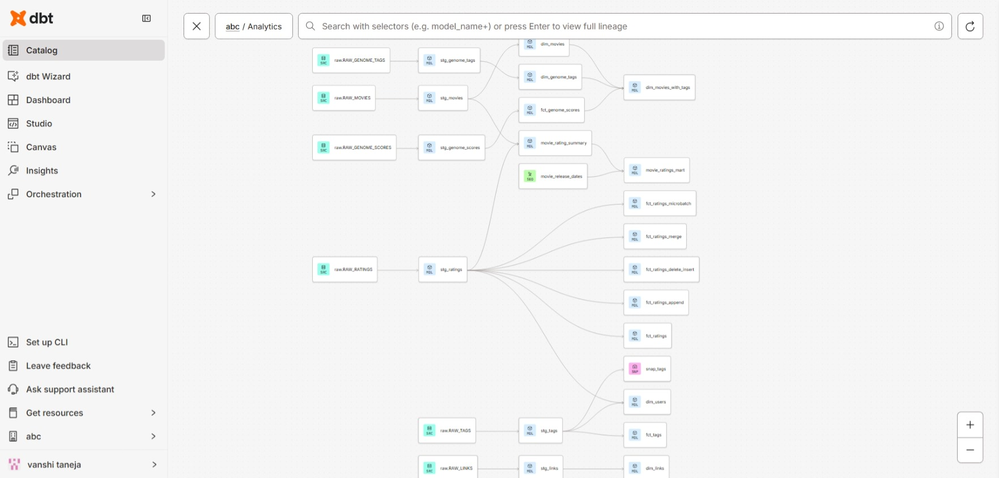

**Daily orchestration job** — `NETFLIX_DBT_DAILY_ORCHESTRATION` running on schedule with a 100% success rate across all recent runs, including automated scheduled triggers at 11:30 AM IST.

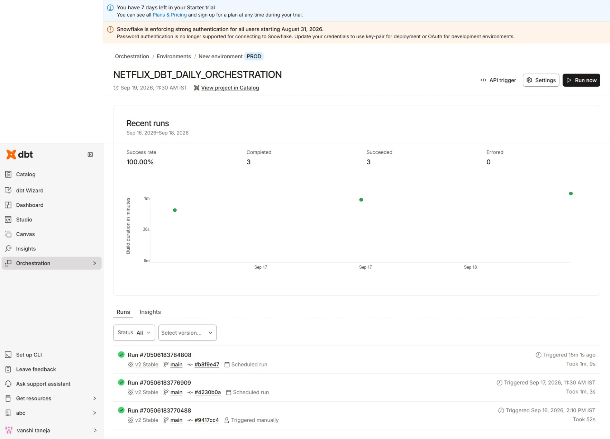

**`dbt build` summary** — models and tests executing together, with pass/fail counts confirming the pipeline runs cleanly end to end.

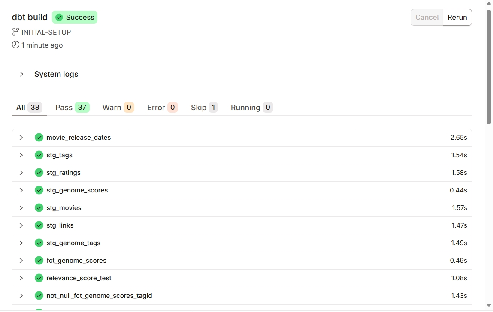

### Snowflake — Incremental Strategies & Snapshots

**Incremental strategy comparison** — all four strategies (append, merge, delete+insert, microbatch) tested against the same data, producing different, individually explainable row counts that demonstrate each strategy's actual behavior.

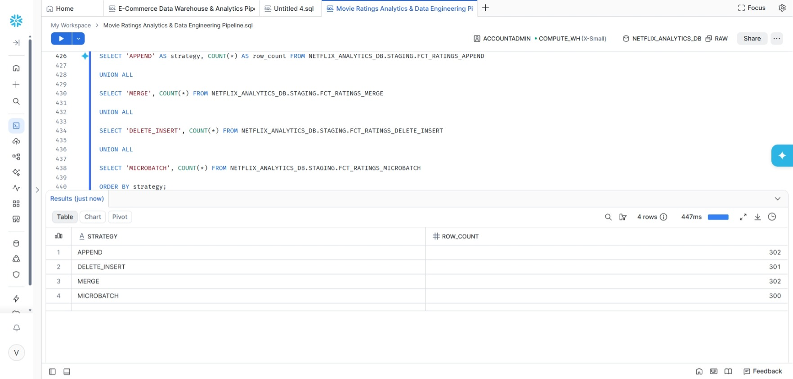

**Active snapshot records** — `snap_tags` showing currently valid rows via `DBT_VALID_TO IS NULL`, proving the SCD Type 2 change-tracking snapshot works correctly.

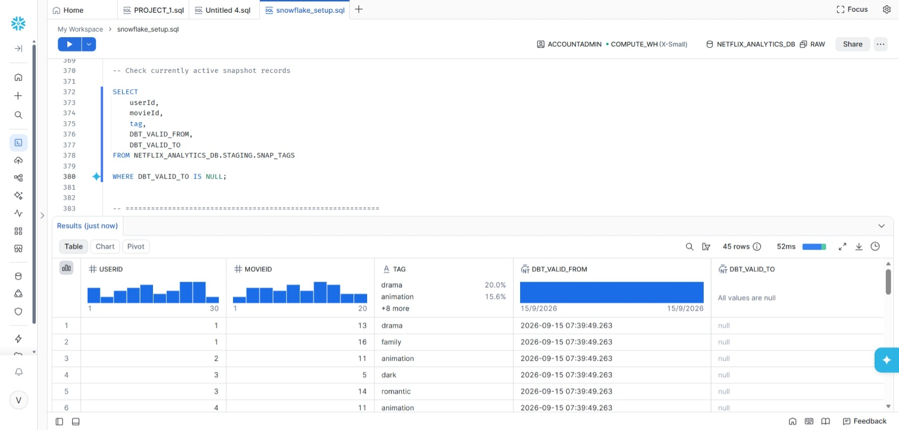

### AWS — Cross-Account Trust

**IAM role trust relationship** — the `NETFLIX-ADMIN` role's trust policy, scoped to Snowflake's IAM user via `sts:AssumeRole` with an external ID condition, rather than an open trust relationship.

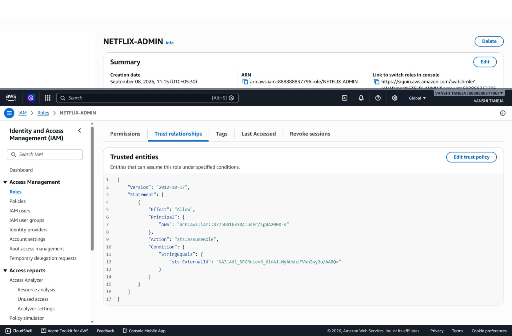

<details>
<summary><strong>Click to see additional validation screenshots</strong></summary>

#### Snowflake — Ingestion & Data Layers
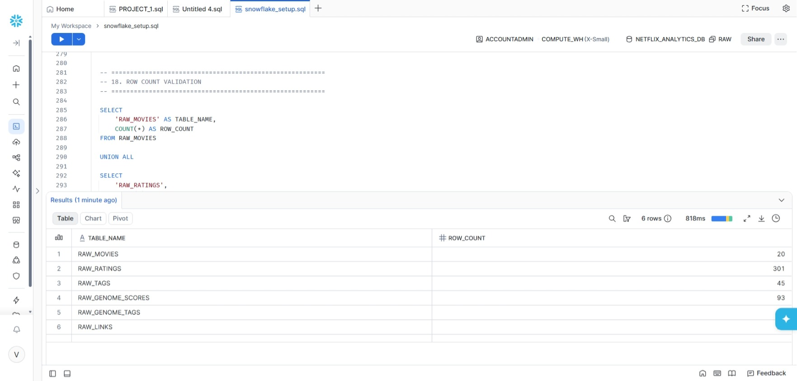
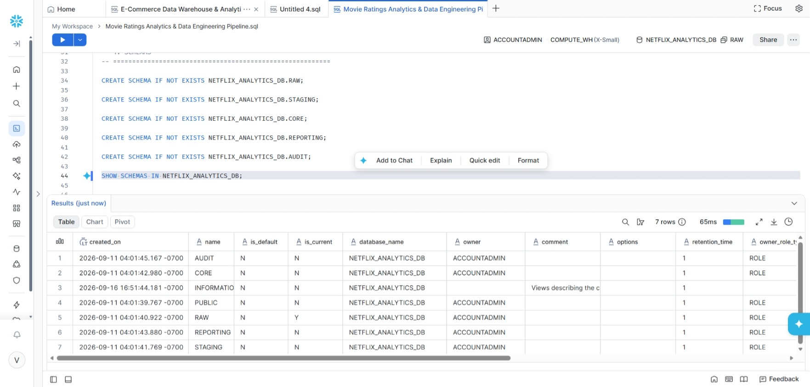
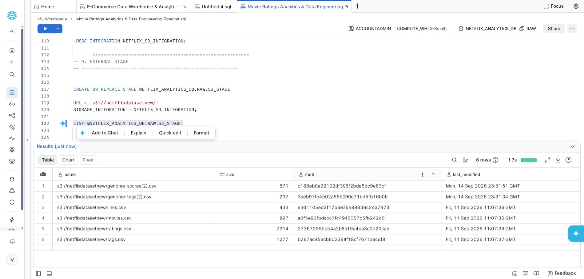
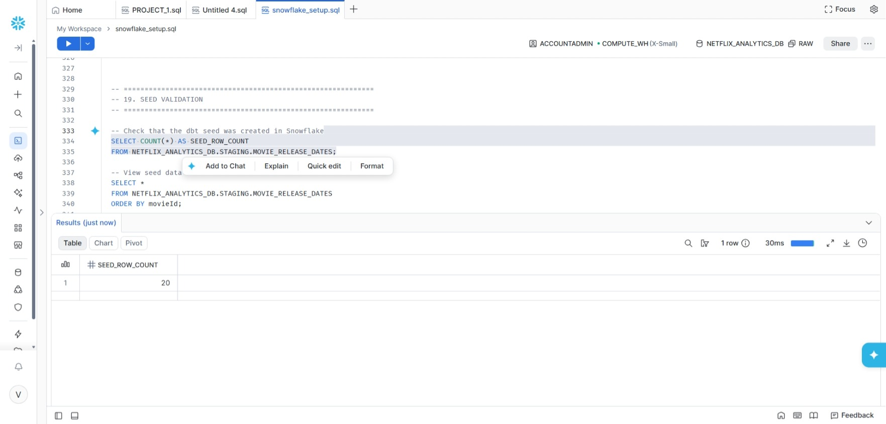
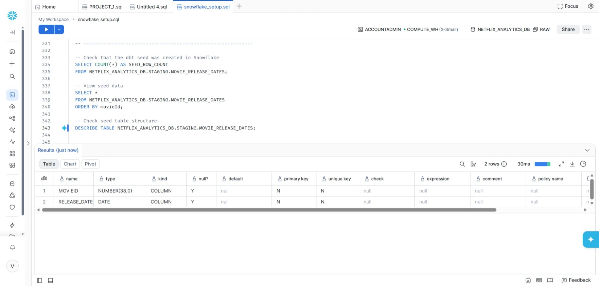
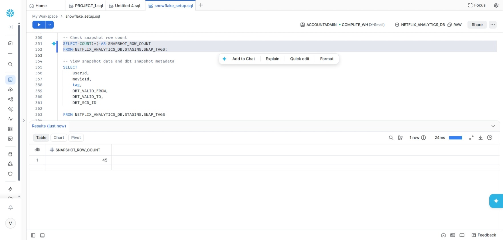
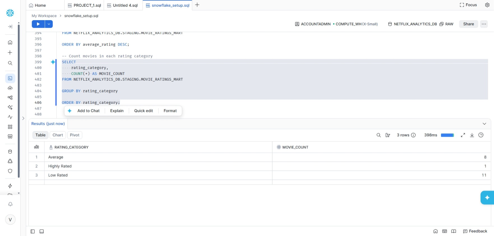
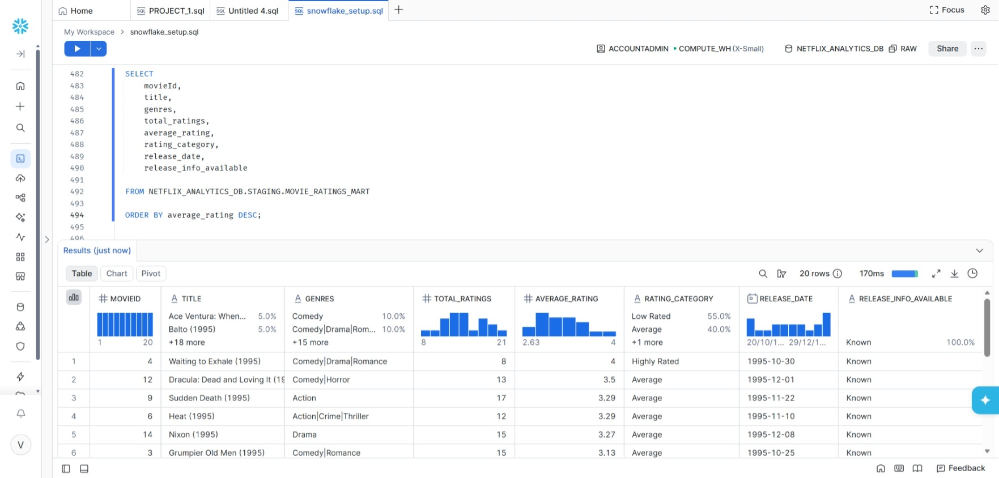

#### dbt — Test Results
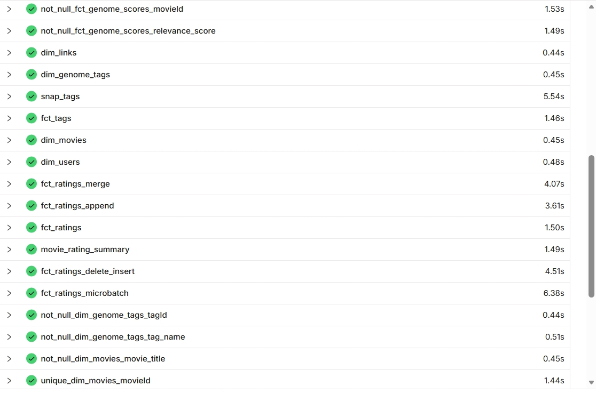

#### AWS — IAM & S3
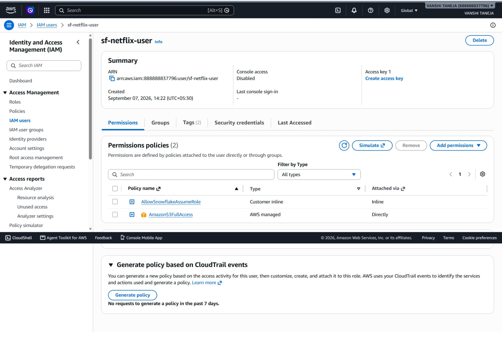
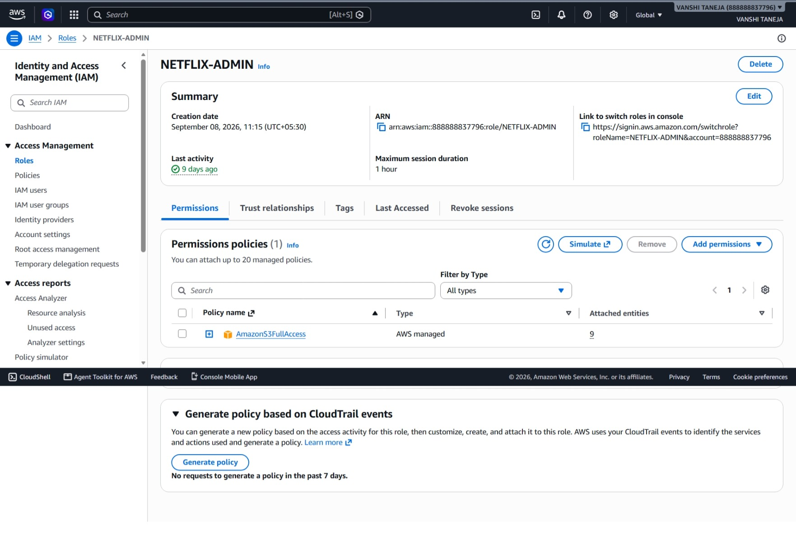
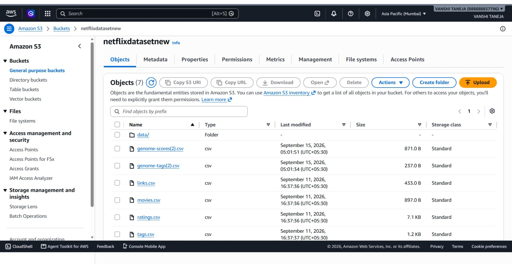

</details>


## **26. Author**

**Vanshi Taneja**

Data Engineering / Analytics

**Technologies:** Snowflake · dbt · SQL · Amazon S3 · GitHub
